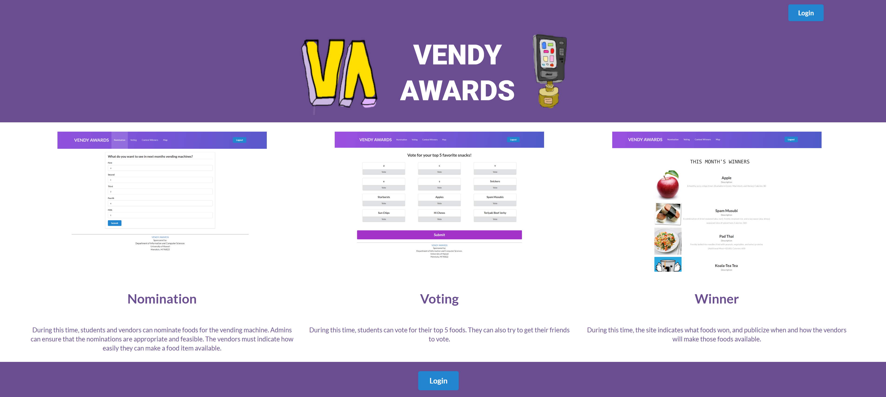
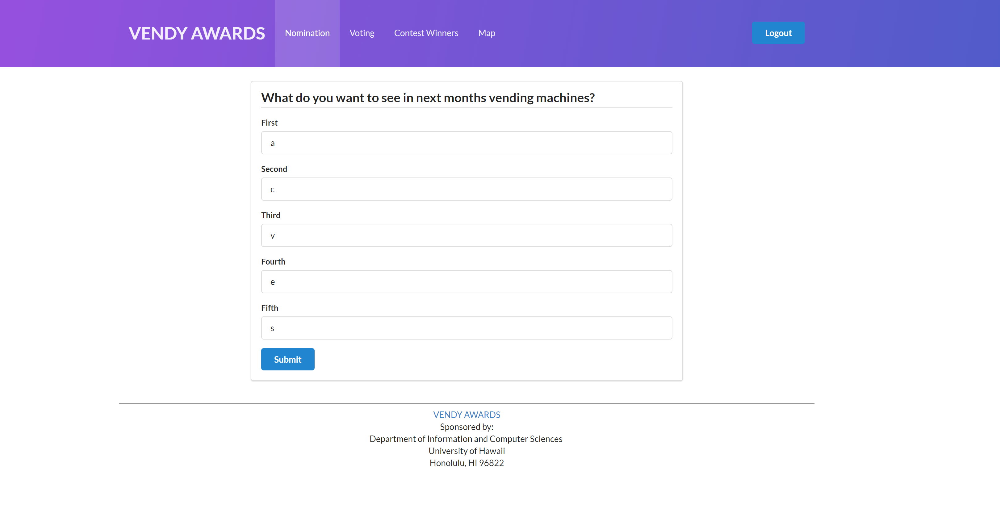
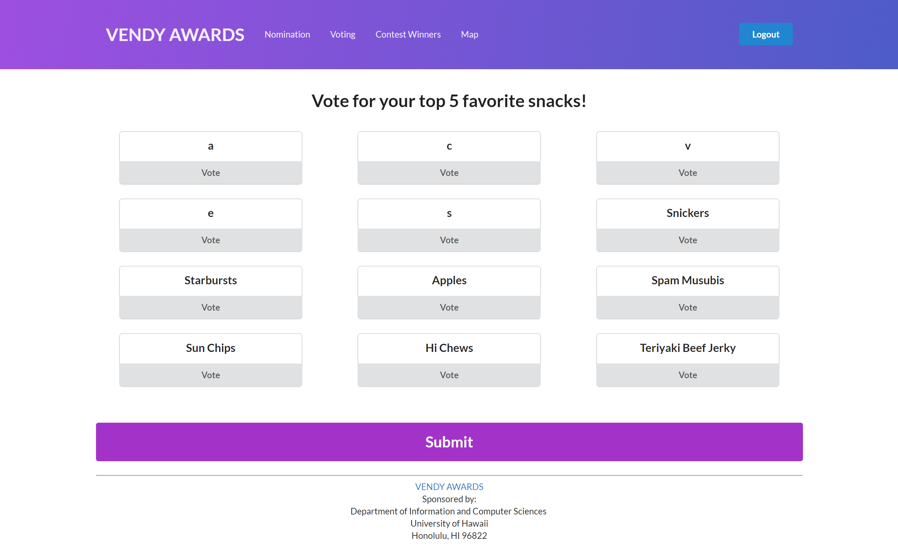
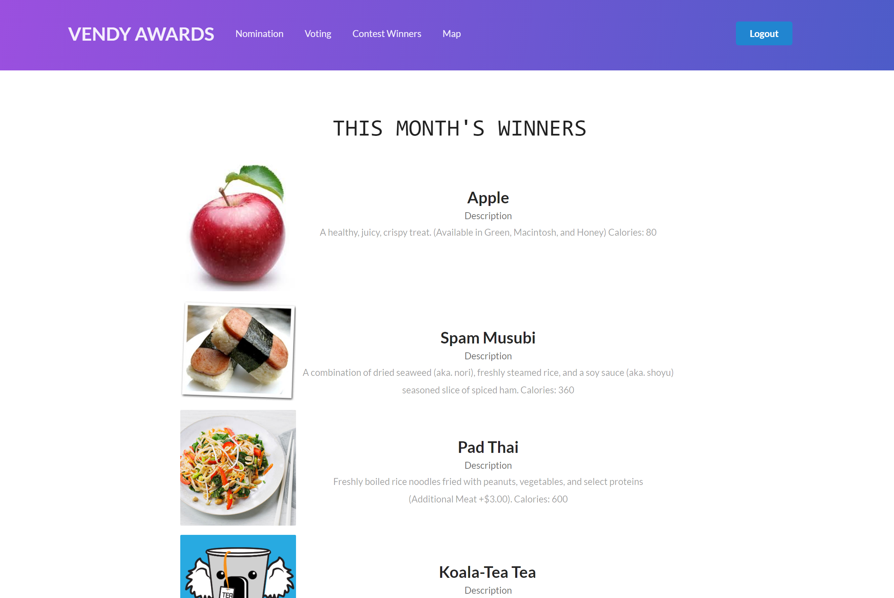
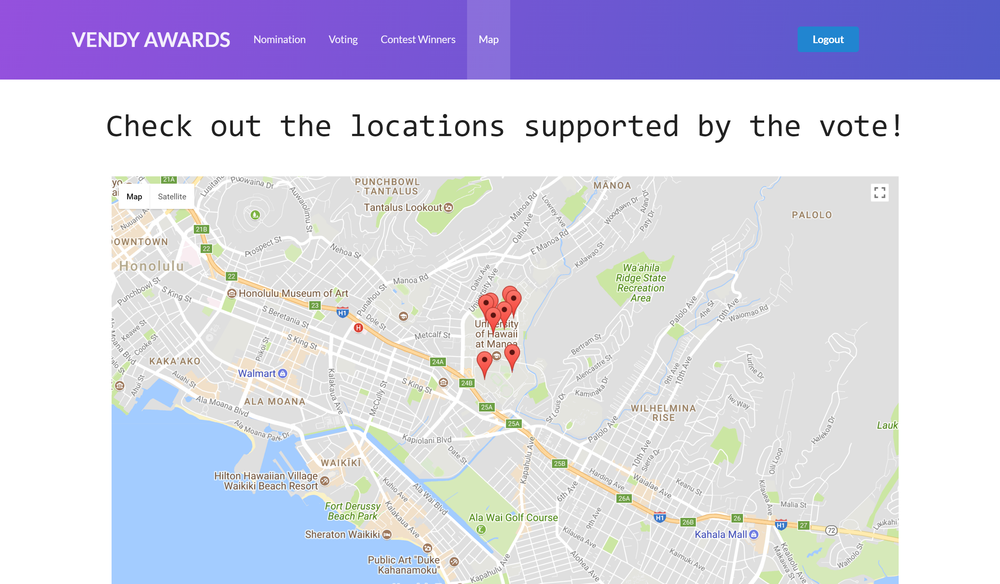
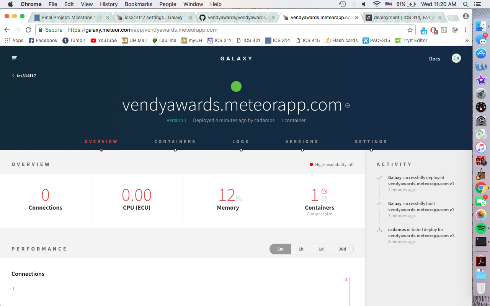
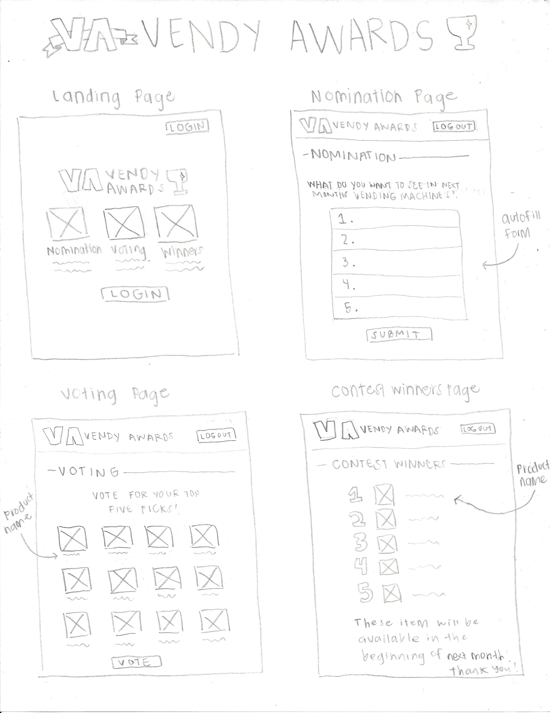
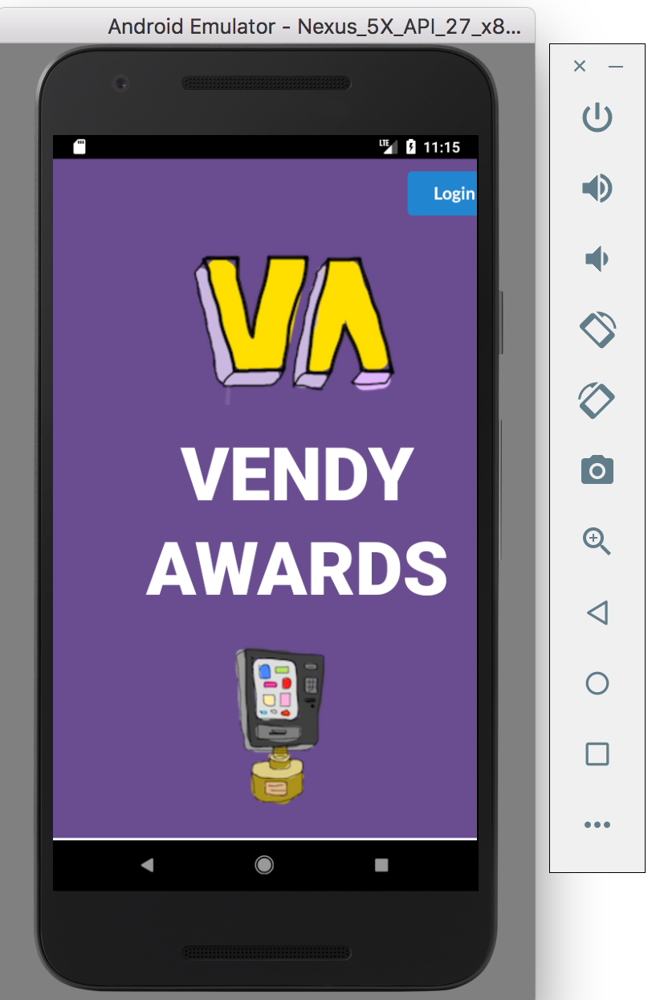

# Vendy Awards

## Table of contents

## <a href="https://vendyawards.meteorapp.com/">Go to deployed app</a>
* <a href ="https://github.com/vendyawards/vendyawards/projects/1">M1 Project Page</a>
* <a href ="https://github.com/vendyawards/vendyawards/projects/2">M2 Project Page</a>
* [About VendyAwards](#about-vendyawards)
* [Digital Mockups](#digital-mockups)
* [Deployment to Galaxy](#deployment-to-galaxy)
* [User Guide](#user-guide)
* [Community Feedback](#community-feedback)
* [Developer Guide](#developer-guide)
* [Written Mockups](#written-mockups)
* [Native Mobile App](#native-mobile-app)


## About VendyAwards
### Overview

Vendy Awards is a Meteor application providing UH students with an opportunity to vote on which snacks get placed in campus vending machines. It gives every student an opportunity to voice out what they feel they would like to see and also give vendors an idea of what students like to eat, improving sales of their vending machine items. Every month will consist of:

1. Nomination period. During this time, students and vendors can nominate foods for the vending machine. Admins can ensure that the nominations are appropriate and feasible. The vendors must indicate how easily they can make a food item available.

2. Voting period. During this time, students can vote for their top 5 foods. They can also try to get their friends to vote.

3. Contest winners. During this time, the site indicates what foods won, and publicize when and where the vendors will make those foods available on the map page.

4. Map. A google map projection of all the vending machines on campus.

## Digital Mockups

### Landing Page


### Nomination Page


### Voting Page


### Contest Winners Page


### Map Page


## Deployment to Galaxy
### Running Deployment of Vendy Awards on Galaxy


## User Guide

1. Landing page: Upon entering the landing page, the user is presented with a short description of each page available in the app along with a screenshot of what each page is expected to look like. There is a login button on the top right corner of the page available for those who are already familiar with the app. There is also a login button available at the bottom of the landing page for those who are new and are not familiar with the app. This allows them to quickly login straight away without having to scroll up for functionality.

2. Nomination page: Upon login, the user is presented with a form where they are allowed to nominate upt to five items that they would like to see in the vending machines next month. 

3. Voting page: When on the voting page, the user is presented with items that have been nominated previously. Then they are allowed to vote for their top five picks. After voting, they are redirected to the map page so they are able to locate the vending machines on campus.

4. Contest winners page: When on the contest winners page, the user can view the top five picks of the all the votes made during the voting process on order from most voted, to least voted. They are allowed to then go to the map page through a link provided at the bottom.

** refer to [Digital Mockups](#digital-mockups) to view images of what is expected of each page.

## Community Feedback

1. Mickey M.: "Not a fan of violet, but good concept. Although, sometimes I can't log out."
2. Chris L. : "Really liked the color gradient, but functionality can improve."
3. Taylor C.: "I love hi chews, I like the fact that can suggest them for vending machines."
4. Harold G.: "I hope to one day see non food items in the vending machines on campus. Thank you for introducing this idea to me."
5. Heather P.: "I don't like how the fonts are not uniform, however, the landing page and map pages are really appealing. The nomination page is very straight forward. I like how the voting page highlights what you've voted for."

## Developer Guide

### Installation

First, [install Meteor](https://www.meteor.com/install).

Second, [download a copy of VendyAwards](https://github.com/vendyawards/vendyawards/archive/master.zip), or clone it using git.
  
Third, cd into the app/ directory and install libraries with:

```
$ meteor npm install
```

Fourth, run the system with:

```
$ meteor npm run start
```

If all goes well, the application will appear at [http://localhost:3000](http://localhost:3000). If you have an account on the UH test CAS server, you can login.  

### Application Design

#### Directory structure

The top-level directory structure contains:

```
app/        # holds the Meteor application sources
config/     # holds configuration files, such as settings.development.json
.gitignore  # don't commit IntelliJ project files, node_modules, and settings.production.json
```

This structure separates configuration files (such as the settings files) in the config/ directory from the actual Meteor application in the app/ directory.

The app/ directory has this top-level structure:

```
client/
  lib/           # holds Semantic UI files.
  head.html      # the <head>
  main.js        # import all the client-side html and js files. 

imports/
  api/           # Define collection processing code (client + server side)
    base/
    interest/
    profile/
  startup/       # Define code to run when system starts up (client-only, server-only)
    client/        
    server/        
  ui/
    components/  # templates that appear inside a page template.
    layouts/     # Layouts contain common elements to all pages (i.e. menubar and footer)
    pages/       # Pages are navigated to by FlowRouter routes.
    stylesheets/ # CSS customizations, if any.

node_modules/    # managed by Meteor

private/
  database/      # holds the JSON file used to initialize the database on startup.

public/          
  images/        # holds static images for landing page and predefined sample users.
  
server/
   main.js       # import all the server-side js files.
```

### Import conventions

This system adheres to the Meteor 1.4 guideline of putting all application code in the imports/ directory, and using client/main.js and server/main.js to import the code appropriate for the client and server in an appropriate order.

This system accomplishes client and server-side importing in a different manner than most Meteor sample applications. In this system, every imports/ subdirectory containing any Javascript or HTML files has a top-level index.js file that is responsible for importing all files in its associated directory.   

Then, client/main.js and server/main.js are responsible for importing all the directories containing code they need. For example, here is the contents of client/main.js:

```
import '/imports/startup/client';
import '/imports/ui/components/form-controls';
import '/imports/ui/components/directory';
import '/imports/ui/components/user';
import '/imports/ui/components/landing';
import '/imports/ui/layouts/directory';
import '/imports/ui/layouts/landing';
import '/imports/ui/layouts/shared';
import '/imports/ui/layouts/user';
import '/imports/ui/pages/directory';
import '/imports/ui/pages/filter';
import '/imports/ui/pages/landing';
import '/imports/ui/pages/user';
import '/imports/api/base';
import '/imports/api/profile';
import '/imports/api/interest';
import '/imports/ui/stylesheets/style.css';
```

Apart from the last line that imports style.css directly, the other lines all invoke the index.js file in the specified directory.

We use this approach to make it more simple to understand what code is loaded and in what order, and to simplify debugging when some code or templates do not appear to be loaded.  In our approach, there are only two places to look for top-level imports: the main.js files in client/ and server/, and the index.js files in import subdirectories. 

Note that this two-level import structure ensures that all code and templates are loaded, but does not ensure that the symbols needed in a given file are accessible.  So, for example, a symbol bound to a collection still needs to be imported into any file that references it. 
 
### Naming conventions

This system adopts the following naming conventions:

  * Files and directories are named in all lowercase, with words separated by hyphens. Example: accounts-config.js
  * "Global" Javascript variables (such as collections) are capitalized. Example: Profiles.
  * Other Javascript variables are camel-case. Example: collectionList.
  * Templates representing pages are capitalized, with words separated by underscores. Example: Directory_Page. The files for this template are lower case, with hyphens rather than underscore. Example: directory-page.html, directory-page.js.
  * Routes to pages are named the same as their corresponding page. Example: Directory_Page.


### Data model

The VendyAwards data model is implemented by two Javascript classes: [ProfileCollection](https://github.com/vendyawards/vendyawards/blob/master/app/imports/api/profile/ProfileCollection.js) and [InterestCollection](https://github.com/vendyawards/vendyawards/blob/master/app/imports/api/interest/InterestCollection.js). Both of these classes encapsulate a MongoDB collection with the same name and export a single variable (Profiles and Interests)that provides access to that collection. 

Any part of the system that manipulates the VendyAwards data model imports the Profiles or Interests variable, and invokes methods of that class to get or set data.

There are many common operations on MongoDB collections. To simplify the implementation, the ProfileCollection and InterestCollection classes inherit from the [BaseCollection](https://github.com/vendyawards/vendyawards/blob/master/app/imports/api/base/BaseCollection.js) class.

The [BaseUtilities](https://github.com/vendyawards/vendyawards/blob/master/app/imports/api/base/BaseUtilities.js) file contains functions that operate across both classes. 

Both ProfileCollection and InterestCollection have Mocha unit tests in [ProfileCollection.test.js](https://github.com/vendyawards/vendyawards/blob/master/app/imports/api/profile/ProfileCollection.test.js) and [InterestCollection.test.js](https://github.com/vendyawards/vendyawards/blob/master/app/imports/api/interest/InterestCollection.test.js). See the section below on testing for more details.

### CSS

The application uses the [Semantic UI](http://semantic-ui.com/) CSS framework. To learn more about the Semantic UI theme integration with Meteor, see [Semantic-UI-Meteor](https://github.com/Semantic-Org/Semantic-UI-Meteor).

The Semantic UI theme files are located in [app/client/lib/semantic-ui](https://github.com/ics-software-engineering/meteor-application-template/tree/master/app/client/lib/semantic-ui) directory. Because they are located in the client/ directory and not the imports/ directory, they do not need to be explicitly imported to be loaded. (Meteor automatically loads all files into the client that are located in the client/ directory). 

Note that the user pages contain a menu fixed to the top of the page, and thus the body element needs to have padding attached to it.  However, the landing page does not have a menu, and thus no padding should be attached to the body element on that page. To accomplish this, the [router](https://github.com/vendyawards/vendyawards/blob/master/app/imports/startup/client/router.js) uses "triggers" to add an remove the appropriate classes from the body element when a page is visited and then left by the user. 

### Routing

For display and navigation among its four pages, the application uses [Flow Router](https://github.com/kadirahq/flow-router).

Routing is defined in [imports/startup/client/router.js](https://github.com/ics-software-engineering/meteor-application-template/blob/master/app/imports/startup/client/router.js).

VendyAwards defines the following routes:

  * The `/` route goes to the public landing page.
  * The `/directory` route goes to the public directory page.
  * The `/<user>/profile` route goes to the profile page associated with `<user>`, which is the UH account name.
  * The `/<user>/filter` route goes to the filter page associated with `<user>`, which is the UH account name.


### Authentication

For authentication, the application uses the University of Hawaii CAS test server, and follows the approach shown in [meteor-example-uh-cas](http://ics-software-engineering.github.io/meteor-example-uh-cas/).

When the application is run, the CAS configuration information must be present in a configuration file such as  [config/settings.development.json](https://github.com/ics-software-engineering/meteor-application-template/blob/master/config/settings.development.json). 

Anyone with a UH account can login and use BowFolio to create a portfolio.  A profile document is created for them if none already exists for that username.

### Authorization

The landing and directory pages are public; anyone can access those pages.

The profile and filter pages require authorization: you must be logged in (i.e. authenticated) through the UH test CAS server, and the authenticated username returned by CAS must match the username specified in the URL.  So, for example, only the authenticated user `johnson` can access the pages `http://localhost:3000/johnson/profile` and  `http://localhost:3000/johnson/filter`.

To prevent people from accessing pages they are not authorized to visit, template-based authorization is used following the recommendations in [Implementing Auth Logic and Permissions](https://kadira.io/academy/meteor-routing-guide/content/implementing-auth-logic-and-permissions). 

The application implements template-based authorization using an If_Authorized template, defined in [If_Authorized.html](https://github.com/vendyawards/vendyawards/blob/master/app/imports/ui/layouts/user/if-authorized.html) and [If_Authorized.js](https://github.com/vendyawards/vendyawards/blob/master/app/imports/ui/layouts/user/if-authorized.js).

### Configuration

The [config](https://github.com/vendyawards/vendyawards/tree/master/config) directory is intended to hold settings files.  The repository contains one file: [config/settings.development.json](https://github.com/vendyawards/vendyawards/blob/master/config/settings.development.json).

The [.gitignore](https://github.com/vendyawards/vendyawards/blob/master/.gitignore) file prevents a file named settings.production.json from being committed to the repository. So, if you are deploying the application, you can put settings in a file named settings.production.json and it will not be committed.

VendyAwards checks on startup to see if it has an empty database in [initialize-database.js](https://github.com/vendyawards/vendyawards/blob/master/app/imports/startup/server/initialize-database.js), and if so, loads the file specified in the configuration file, such as [settings.development.json](https://github.com/vendyawards/vendyawards/blob/master/config/settings.development.json).  For development purposes, a sample initialization for this database is in [initial-collection-data.json](https://github.com/vendyawards/vendyawards/blob/master/app/private/database/initial-collection-data.json).

### Quality Assurance

#### ESLint

VendyAwards includes a [.eslintrc](https://github.com/vendyawards/vendyawards/blob/master/app/.eslintrc) file to define the coding style adhered to in this application. You can invoke ESLint from the command line as follows:

```
meteor npm run lint
```

ESLint should run without generating any errors.  

It's significantly easier to do development with ESLint integrated directly into your IDE (such as IntelliJ).

#### Data model unit tests

To run the unit tests on the data model, invoke the script named 'test', which is defined in the package.json file:

```
meteor npm run test
```

This outputs the results to the console. Here is an example of a successful run, with timestamps removed:

```
[~/github/vendyawards/vendyawards/app]-> meteor npm run test

> vendyawards@ test /Users/philipjohnson/github/vendyawards/vendyawards/app
> TEST_WATCH=1 meteor test --driver-package meteortesting:mocha

[[[[[ Tests ]]]]]                             

=> Started proxy.                             
=> Started MongoDB.  
                         
(STDERR) Note: you are using a pure-JavaScript implementation of bcrypt.
(STDERR) While this implementation will work correctly, it is known to be
(STDERR) approximately three times slower than the native implementation.
(STDERR) In order to use the native implementation instead, run
(STDERR) 
(STDERR)   meteor npm install --save bcrypt
(STDERR) 
(STDERR) in the root directory of your application.

 --------------------------------
 ----- RUNNING SERVER TESTS -----
 --------------------------------
   
=> Started your app.

=> App running at: http://localhost:3000/
    InterestCollection
    ✓ #define, #isDefined, #removeIt, #dumpOne, #restoreOne (69ms)
    ✓ #findID, #findIDs  
    ProfileCollection
    ✓ #define, #isDefined, #removeIt, #dumpOne, #restoreOne (66ms)
    ✓ #define (illegal interest)
    ✓ #define (duplicate interests)

   5 passing (178ms)

Load the app in a browser to run client tests, or set the TEST_BROWSER_DRIVER environment variable. See https://github.com/DispatchMe/meteor-mocha/blob/master/README.md#run-app-tests
```


#### JSDoc

VendyAwards supports documentation generation with [JSDoc](http://usejsdoc.org/). The package.json file defines a script called jsdoc that runs JSDoc over the source files and outputs html to the ../../bowfolio.github.io/jsdoc directory.  When committed, the index.html file providing an overview of all the documentation generate at that point in time is available at [http://vendyawards.github.io/jsdocs](https://vendyawards.github.io/jsdocs/). 

### Development History

The development process for VendyAwards conformed to [Issue Driven Project Management](http://courses.ics.hawaii.edu/ics314f16/modules/project-management/) practices. In a nutshell, development consists of a sequence of Milestones. Milestones consist of issues corresponding to 2-3 day tasks. GitHub projects are used to manage the processing of tasks during a milestone.  

## Written Mockups



1. Landing page: Anyone with a UH account can login to VendyAwards by clicking on the login button. The UH CAS authentication screen then appears and requests your UH account and password. Depending on the time of the month, they will be redirected to either the Nomination page, Voting page, or Contest Winners page.

2. Nomination Page: Once authenticated, the user will fill out a form with five items that they would like to see in the vending machines next month. Our autofill format will fill out the rest of an entry if the item is available or a previous user has nominated it already. When the submit button is pressed, a confirmation will ask if they want to submit their nominations. If they select yes, an alert will thank them for their submission and they will be redirected to the landing page. Otherwise, they will have a chance to change their answers if needed.

3. Voting Page: During this period, users will pick their top five items out of the most voted items listed on the page. When the vote button is pressed, a confirmation will ask if they want to submit their vote. If they select yes, an alert will thank them for their vote and they will be redirected to the landing page. Otherwise, they will have a chance to change their votes if needed.

4. Contest Winners Page: When the voting period is over, the top five voted items will be listed along with the date of when these items will be available in the UH vending machines, and the location of the vending machines supporting the VendyAward products.

5. Map Page: Lists all the vending machines and their locations that support the vendy award winning selections in a map format.

## Native Mobile App


Extra credit submission of our mobile app.
