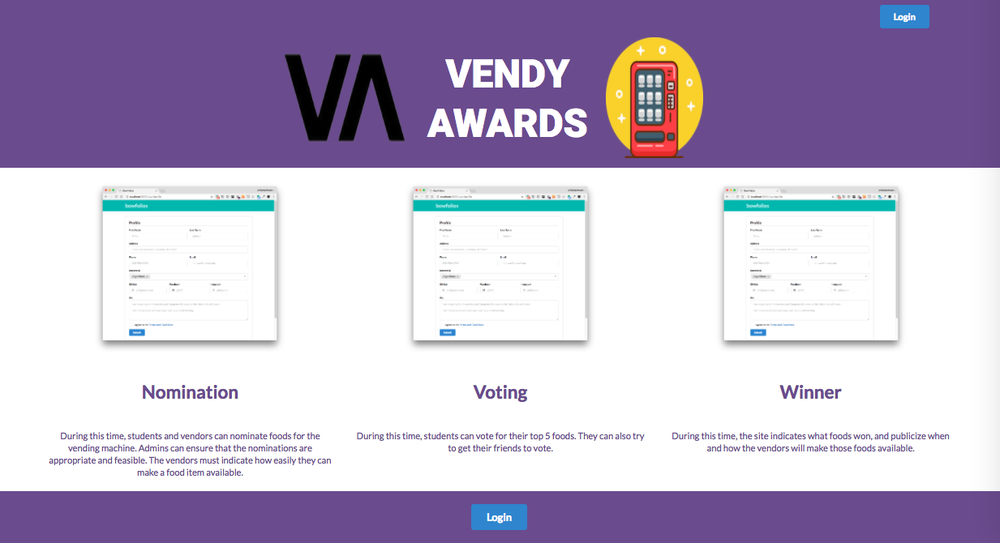
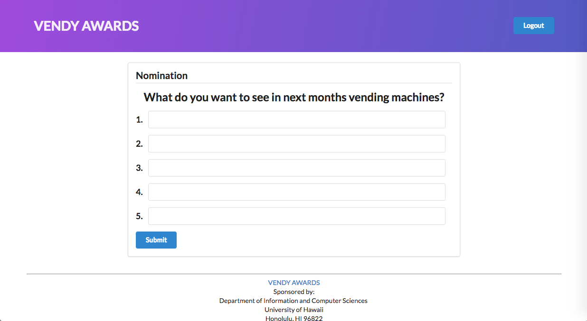
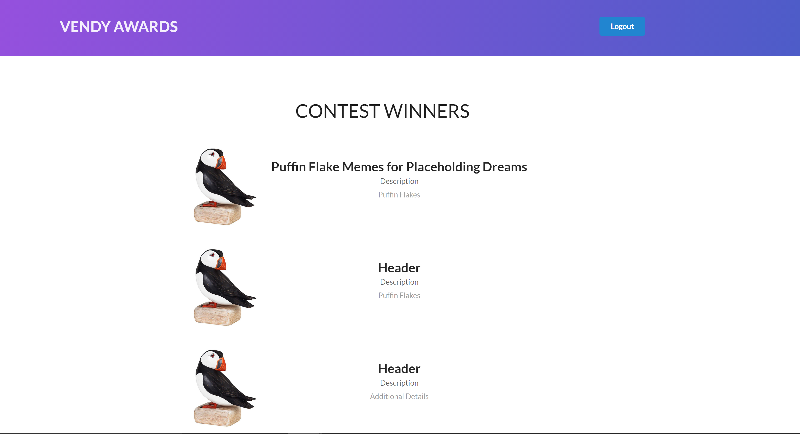

# Vendy Awards

## Table of contents

* <a href="https://galaxy.meteor.com/app/vendyawards.meteorapp.com/">## Veiw Vendy Awards App</a>
* <a href ="https://github.com/vendyawards/vendyawards/projects/1">M1 Project Page</a>
* <a href ="https://github.com/vendyawards/vendyawards/projects/2">M2 Project Page</a>
* [About VendyAwards](#about-vendyawards)
* [Digital Mockups](#digital-mockups)
* [Deployment to Galaxy](#deployment-to-galaxy)
* [Written Mockups](#written-mockups)

## About VendyAwards 

Vendy Awards is a Meteor application providing UH students with an opportunity to vote on which snacks get placed in campus vending machines. Every month will consist of:

1. Nomination period. During this time, students and vendors can nominate foods for the vending machine. Admins can ensure that the nominations are appropriate and feasible. The vendors must indicate how easily they can make a food item available.

2. Voting period. During this time, students can vote for their top 5 foods. They can also try to get their friends to vote.

3. Contest winners. During this time, the site indicates what foods won, and publicize when and how the vendors will make those foods available.

## Digital Mockups

### Landing Page

### Nomination Page

### Contest Winners Page (WIP)

## Deployment to Galaxy
### Running Deployment of Vendy Awards on Galaxy

## Written Mockups

1. Landing page: Anyone with a UH account can login to BowFolios by clicking on the login button. The UH CAS authentication screen then appears and requests your UH account and password. Depending on the time of the month, they will be redirected to either the Nomination page, Voting page, or Contest Winners page.

2. Nomination Page: Once authenticated, the user will fill out a form with five items that they would like to see in the vending machines next month. Our autofill format will fill out the rest of an entry if the item is available or a previous user has nominated it already. When the submit button is pressed, a confirmation will ask if they want to submit their nominations. If they select yes, an alert will thank them for their submission and they will be redirected to the landing page. Otherwise, they will have a chance to change their answers if needed.

3. Voting Page: During this period, users will pick their top five items out of the most voted items listed on the page. When the vote button is pressed, a confirmation will ask if they want to submit their vote. If they select yes, an alert will thank them for their vote and they will be redirected to the landing page. Otherwise, they will have a chance to change their votes if needed.

4. Contest Winners Page: When the voting period is over, the top five voted items will be listed along with the date of when these items will be available in the UH vending machines, and the location of the vending machines supporting the VendyAward products.

5. Map Page: Lists all the vending machines and their locations that support the vendy award winning selections in a map format.
